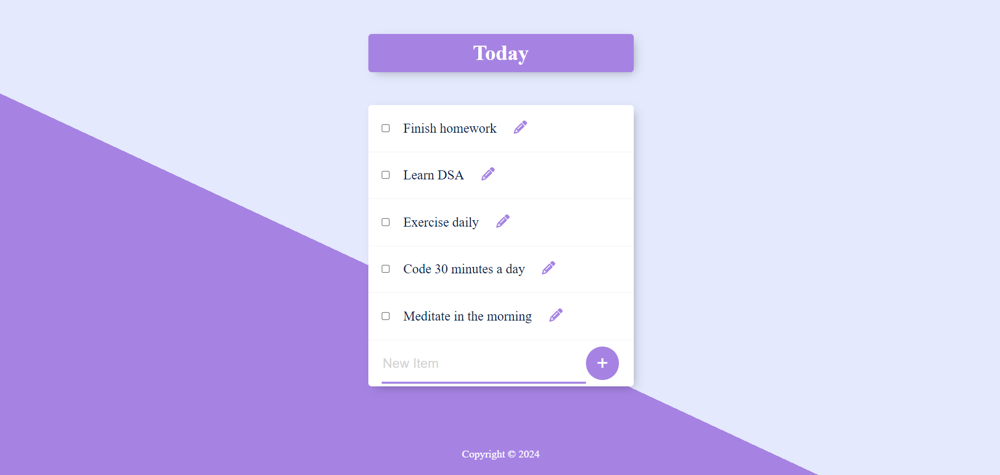

# Permalist Application

Permalist is a simple web application built with Node.js, Express.js, PostgreSQL, and EJS. It allows users to create, edit, and delete items in a list.

# Preview



## Installation

1. Clone the repository:  https://github.com/KRISHNAKUMARPS2002/Permalist-Application.git

2. Navigate to the project directory:  cd postgres_todo

3. Install dependencies:

3. Install dependencies: npm install 


## Usage

1. Start the server:  npm start

2. Open your web browser and go to [http://localhost:3000](http://localhost:3000) to access the application.

## Dependencies

- Express.js: Web framework for Node.js
- Body-parser: Middleware to parse incoming request bodies
- pg: PostgreSQL client for Node.js
- EJS: Embedded JavaScript templates for HTML rendering

## Configuration

Make sure you have PostgreSQL installed and running. Update the database configuration in `index.js` with your PostgreSQL credentials:
```javascript
const db = new pg.Client({
user: "your_username",
host: "localhost",
database: "permalist",
password: "your_password",
port: 5432,
});
